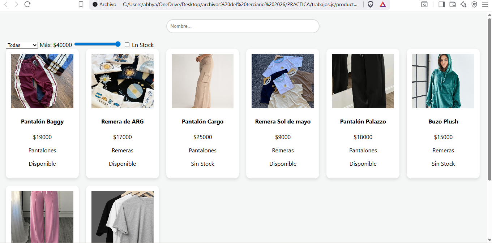
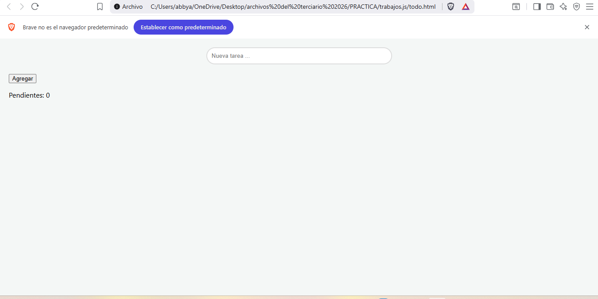
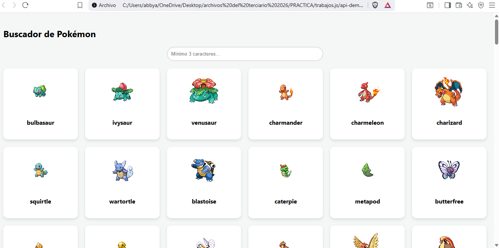

PROYECTO: Aplicación Web Interactiva

​NOMBRE Y APELLIDO: Abigail Aramayo

​DESCRIPCIÓN DEL PROYECTO:
​Este proyecto es una plataforma web integral que demuestra habilidades en el desarrollo de interfaces interactivas, manipulación del DOM y consumo de datos externos. Se compone de tres secciones principales:
​GESTIÓN DE PRODUCTOS
(productos.html): Un catálogo de indumentaria que permite filtrar  por nombre, categoría, rango de precio y disponibilidad de stock.
​Lista de Tareas (todo.html): Una herramienta de organización para prendas o pedidos, donde se pueden agregar nuevos ítems, tacharlos como completados o eliminarlos, con un contador en tiempo real.
​Buscador Pokémon (api-demo.html): Una aplicación que consume la PokéAPI para buscar y visualizar información e imágenes de Pokémon de forma dinámica.

​TECNOLOGIAS UTILIZADAS:
​HTML5: Estructura semántica de las páginas.
​CSS3: Diseño, uso de variables (:root), Grid Layout para la adaptabilidad (responsive) y transiciones .
​JavaScript (ES6+): Lógica funcional, manejo de eventos en tiempo real y filtrado de arreglos.
​Fetch API: Conexión y obtención de datos asincrónicos desde una API externa.

INSTRUCCIONES DE USO:
Seguí estos pasos para ejecutar el proyecto en tu entorno local y conocer todas sus funcionalidades:
Requisitos Previos
Tener instalado **Visual Studio Code**.
Instalar la extensión **Live Server** en VS Code (necesaria para el correcto funcionamiento de las peticiones a la API).

Configuración y Estructura
Asegurate de mantener la estructura de carpetas: Los archivos HTML deben estar en la raíz y el archivo de estilos en `css/app.css`.
No es necesario instalar dependencias externas, ya que el proyecto utiliza Vanilla JavaScript y CSS nativo.

Ejecución
Abrí la carpeta del proyecto en Visual Studio Code.
Hacé clic derecho sobre cualquiera de los archivos HTML (ej: `productos.html` o `api-demo.html`).
Seleccioná la opción "Open with Live Server". Esto abrirá la aplicación en tu navegador predeterminado bajo una dirección local .

Guía de Funcionalidades
Catálogo de Productos: Utilizá el buscador y los filtros laterales. El filtrado de precio y stock es instantáneo gracias a la lógica de JavaScript.
Gestor de Tareas:Agregá prendas a la lista. Hacé clic sobre el nombre de la tarea para marcarla como "completada" (se tachará automáticamente) o usá el botón de eliminar para quitarla y actualizar el contador.
Buscador Pokémon: Escribí el nombre de un Pokémon. El sistema realizará una petición a laPokéAPI y generará una tarjeta visual con los datos obtenidos en tiempo real.

CAPTURAS DE PANTALLA:

LINK DE DEPLOY
https://abigail-aramayo.github.io/TP-javaScript/